# Heart Failure Prediction - Statistical Study
**Author**: Gabriel Espinola Lincoln Ferreira dos Santos

Heart failure (HF), also known as congestive heart failure (CHF), decompensatio cordis (DC), and congestive cardiac failure (CCF), is when the heart is unable to pump sufficiently to maintain blood flow to meet the body's needs. The study intend to do statistical analysis for heart failure in a dataset contains 12 features that can be used to predict mortality and correlating with articles.

Definition of done: Create a model for predicting mortality caused by Heart Failure.

Reference: 
Accessed by Capes periodicos

1. MCMURRAY,John; PONIKOWSKI,Piotr. **Heart Failure Not Enough Pump Iron?** Glasgow, Scotland, United Kingdom and Wroclaw, Poland

2. AM,Heart J **Clinical predictors of heart failure in patients with first acute myocardial infarction** 

3. ALI,Abbas S.;**Clinical predictors of heart failure in patients with first acute myocardial infarction**

4. GOMES,Marilia B **Impact of Diabetes on Cardiovascular Disease: An Update**

5. **Creatine phosphokinase test**: https://www.mountsinai.org/health-library/tests/creatine-phosphokinase-test

6. Mohammed W. Akhter; **Effect of Elevated Admission Serum Creatinine and Its Worsening on Outcome in Hospitalized Patients With Decompensated Heart Failure negrito**

7. Matheus, Alessandra; **Impact of Diabetes on Cardiovascular Disease: An Update**

8. Abbas S. Ali; **Clinical predictors of heart failure in patients with first acute myocardial infarction**


```python
import pandas as pd
import matplotlib.pyplot as plt
import seaborn as sns
df = pd.read_csv('Dataset.csv')
df.head(15)
```


<div>
<style scoped>
    .dataframe tbody tr th:only-of-type {
        vertical-align: middle;
    }

    .dataframe tbody tr th {
        vertical-align: top;
    }

    .dataframe thead th {
        text-align: right;
    }
</style>
<table border="1" class="dataframe">
  <thead>
    <tr style="text-align: right;">
      <th></th>
      <th>age</th>
      <th>anaemia</th>
      <th>creatinine_phosphokinase</th>
      <th>diabetes</th>
      <th>ejection_fraction</th>
      <th>high_blood_pressure</th>
      <th>platelets</th>
      <th>serum_creatinine</th>
      <th>serum_sodium</th>
      <th>sex</th>
      <th>smoking</th>
      <th>time</th>
      <th>DEATH_EVENT</th>
    </tr>
  </thead>
  <tbody>
    <tr>
      <th>0</th>
      <td>75.0</td>
      <td>0</td>
      <td>582</td>
      <td>0</td>
      <td>20</td>
      <td>1</td>
      <td>265000.00</td>
      <td>1.9</td>
      <td>130</td>
      <td>1</td>
      <td>0</td>
      <td>4</td>
      <td>1</td>
    </tr>
    <tr>
      <th>1</th>
      <td>55.0</td>
      <td>0</td>
      <td>7861</td>
      <td>0</td>
      <td>38</td>
      <td>0</td>
      <td>263358.03</td>
      <td>1.1</td>
      <td>136</td>
      <td>1</td>
      <td>0</td>
      <td>6</td>
      <td>1</td>
    </tr>
    <tr>
      <th>2</th>
      <td>65.0</td>
      <td>0</td>
      <td>146</td>
      <td>0</td>
      <td>20</td>
      <td>0</td>
      <td>162000.00</td>
      <td>1.3</td>
      <td>129</td>
      <td>1</td>
      <td>1</td>
      <td>7</td>
      <td>1</td>
    </tr>
    <tr>
      <th>3</th>
      <td>50.0</td>
      <td>1</td>
      <td>111</td>
      <td>0</td>
      <td>20</td>
      <td>0</td>
      <td>210000.00</td>
      <td>1.9</td>
      <td>137</td>
      <td>1</td>
      <td>0</td>
      <td>7</td>
      <td>1</td>
    </tr>
    <tr>
      <th>4</th>
      <td>65.0</td>
      <td>1</td>
      <td>160</td>
      <td>1</td>
      <td>20</td>
      <td>0</td>
      <td>327000.00</td>
      <td>2.7</td>
      <td>116</td>
      <td>0</td>
      <td>0</td>
      <td>8</td>
      <td>1</td>
    </tr>
    <tr>
      <th>5</th>
      <td>90.0</td>
      <td>1</td>
      <td>47</td>
      <td>0</td>
      <td>40</td>
      <td>1</td>
      <td>204000.00</td>
      <td>2.1</td>
      <td>132</td>
      <td>1</td>
      <td>1</td>
      <td>8</td>
      <td>1</td>
    </tr>
    <tr>
      <th>6</th>
      <td>75.0</td>
      <td>1</td>
      <td>246</td>
      <td>0</td>
      <td>15</td>
      <td>0</td>
      <td>127000.00</td>
      <td>1.2</td>
      <td>137</td>
      <td>1</td>
      <td>0</td>
      <td>10</td>
      <td>1</td>
    </tr>
    <tr>
      <th>7</th>
      <td>60.0</td>
      <td>1</td>
      <td>315</td>
      <td>1</td>
      <td>60</td>
      <td>0</td>
      <td>454000.00</td>
      <td>1.1</td>
      <td>131</td>
      <td>1</td>
      <td>1</td>
      <td>10</td>
      <td>1</td>
    </tr>
    <tr>
      <th>8</th>
      <td>65.0</td>
      <td>0</td>
      <td>157</td>
      <td>0</td>
      <td>65</td>
      <td>0</td>
      <td>263358.03</td>
      <td>1.5</td>
      <td>138</td>
      <td>0</td>
      <td>0</td>
      <td>10</td>
      <td>1</td>
    </tr>
    <tr>
      <th>9</th>
      <td>80.0</td>
      <td>1</td>
      <td>123</td>
      <td>0</td>
      <td>35</td>
      <td>1</td>
      <td>388000.00</td>
      <td>9.4</td>
      <td>133</td>
      <td>1</td>
      <td>1</td>
      <td>10</td>
      <td>1</td>
    </tr>
    <tr>
      <th>10</th>
      <td>75.0</td>
      <td>1</td>
      <td>81</td>
      <td>0</td>
      <td>38</td>
      <td>1</td>
      <td>368000.00</td>
      <td>4.0</td>
      <td>131</td>
      <td>1</td>
      <td>1</td>
      <td>10</td>
      <td>1</td>
    </tr>
    <tr>
      <th>11</th>
      <td>62.0</td>
      <td>0</td>
      <td>231</td>
      <td>0</td>
      <td>25</td>
      <td>1</td>
      <td>253000.00</td>
      <td>0.9</td>
      <td>140</td>
      <td>1</td>
      <td>1</td>
      <td>10</td>
      <td>1</td>
    </tr>
    <tr>
      <th>12</th>
      <td>45.0</td>
      <td>1</td>
      <td>981</td>
      <td>0</td>
      <td>30</td>
      <td>0</td>
      <td>136000.00</td>
      <td>1.1</td>
      <td>137</td>
      <td>1</td>
      <td>0</td>
      <td>11</td>
      <td>1</td>
    </tr>
    <tr>
      <th>13</th>
      <td>50.0</td>
      <td>1</td>
      <td>168</td>
      <td>0</td>
      <td>38</td>
      <td>1</td>
      <td>276000.00</td>
      <td>1.1</td>
      <td>137</td>
      <td>1</td>
      <td>0</td>
      <td>11</td>
      <td>1</td>
    </tr>
    <tr>
      <th>14</th>
      <td>49.0</td>
      <td>1</td>
      <td>80</td>
      <td>0</td>
      <td>30</td>
      <td>1</td>
      <td>427000.00</td>
      <td>1.0</td>
      <td>138</td>
      <td>0</td>
      <td>0</td>
      <td>12</td>
      <td>0</td>
    </tr>
  </tbody>
</table>
</div>


```python

```


```python
df.isnull().values.any()
```


    False


```python
total = df.shape[0]
print("total of pacients %s"%(total))

```

    total of pacients 299
    


```python
total_death =df[df['DEATH_EVENT'] == 1 ].count()[0]
```

The dataset has 13 features from 299 pacients  


```python
df.describe()
```


<div>
<style scoped>
    .dataframe tbody tr th:only-of-type {
        vertical-align: middle;
    }

    .dataframe tbody tr th {
        vertical-align: top;
    }

    .dataframe thead th {
        text-align: right;
    }
</style>
<table border="1" class="dataframe">
  <thead>
    <tr style="text-align: right;">
      <th></th>
      <th>age</th>
      <th>anaemia</th>
      <th>creatinine_phosphokinase</th>
      <th>diabetes</th>
      <th>ejection_fraction</th>
      <th>high_blood_pressure</th>
      <th>platelets</th>
      <th>serum_creatinine</th>
      <th>serum_sodium</th>
      <th>sex</th>
      <th>smoking</th>
      <th>time</th>
      <th>DEATH_EVENT</th>
    </tr>
  </thead>
  <tbody>
    <tr>
      <th>count</th>
      <td>299.000000</td>
      <td>299.000000</td>
      <td>299.000000</td>
      <td>299.000000</td>
      <td>299.000000</td>
      <td>299.000000</td>
      <td>299.000000</td>
      <td>299.00000</td>
      <td>299.000000</td>
      <td>299.000000</td>
      <td>299.00000</td>
      <td>299.000000</td>
      <td>299.00000</td>
    </tr>
    <tr>
      <th>mean</th>
      <td>60.833893</td>
      <td>0.431438</td>
      <td>581.839465</td>
      <td>0.418060</td>
      <td>38.083612</td>
      <td>0.351171</td>
      <td>263358.029264</td>
      <td>1.39388</td>
      <td>136.625418</td>
      <td>0.648829</td>
      <td>0.32107</td>
      <td>130.260870</td>
      <td>0.32107</td>
    </tr>
    <tr>
      <th>std</th>
      <td>11.894809</td>
      <td>0.496107</td>
      <td>970.287881</td>
      <td>0.494067</td>
      <td>11.834841</td>
      <td>0.478136</td>
      <td>97804.236869</td>
      <td>1.03451</td>
      <td>4.412477</td>
      <td>0.478136</td>
      <td>0.46767</td>
      <td>77.614208</td>
      <td>0.46767</td>
    </tr>
    <tr>
      <th>min</th>
      <td>40.000000</td>
      <td>0.000000</td>
      <td>23.000000</td>
      <td>0.000000</td>
      <td>14.000000</td>
      <td>0.000000</td>
      <td>25100.000000</td>
      <td>0.50000</td>
      <td>113.000000</td>
      <td>0.000000</td>
      <td>0.00000</td>
      <td>4.000000</td>
      <td>0.00000</td>
    </tr>
    <tr>
      <th>25%</th>
      <td>51.000000</td>
      <td>0.000000</td>
      <td>116.500000</td>
      <td>0.000000</td>
      <td>30.000000</td>
      <td>0.000000</td>
      <td>212500.000000</td>
      <td>0.90000</td>
      <td>134.000000</td>
      <td>0.000000</td>
      <td>0.00000</td>
      <td>73.000000</td>
      <td>0.00000</td>
    </tr>
    <tr>
      <th>50%</th>
      <td>60.000000</td>
      <td>0.000000</td>
      <td>250.000000</td>
      <td>0.000000</td>
      <td>38.000000</td>
      <td>0.000000</td>
      <td>262000.000000</td>
      <td>1.10000</td>
      <td>137.000000</td>
      <td>1.000000</td>
      <td>0.00000</td>
      <td>115.000000</td>
      <td>0.00000</td>
    </tr>
    <tr>
      <th>75%</th>
      <td>70.000000</td>
      <td>1.000000</td>
      <td>582.000000</td>
      <td>1.000000</td>
      <td>45.000000</td>
      <td>1.000000</td>
      <td>303500.000000</td>
      <td>1.40000</td>
      <td>140.000000</td>
      <td>1.000000</td>
      <td>1.00000</td>
      <td>203.000000</td>
      <td>1.00000</td>
    </tr>
    <tr>
      <th>max</th>
      <td>95.000000</td>
      <td>1.000000</td>
      <td>7861.000000</td>
      <td>1.000000</td>
      <td>80.000000</td>
      <td>1.000000</td>
      <td>850000.000000</td>
      <td>9.40000</td>
      <td>148.000000</td>
      <td>1.000000</td>
      <td>1.00000</td>
      <td>285.000000</td>
      <td>1.00000</td>
    </tr>
  </tbody>
</table>
</div>


```python
df.mean()
```


    age                             60.833893
    anaemia                          0.431438
    creatinine_phosphokinase       581.839465
    diabetes                         0.418060
    ejection_fraction               38.083612
    high_blood_pressure              0.351171
    platelets                   263358.029264
    serum_creatinine                 1.393880
    serum_sodium                   136.625418
    sex                              0.648829
    smoking                          0.321070
    time                           130.260870
    DEATH_EVENT                      0.321070
    dtype: float64


```python
df.median()
```


    age                             60.0
    anaemia                          0.0
    creatinine_phosphokinase       250.0
    diabetes                         0.0
    ejection_fraction               38.0
    high_blood_pressure              0.0
    platelets                   262000.0
    serum_creatinine                 1.1
    serum_sodium                   137.0
    sex                              1.0
    smoking                          0.0
    time                           115.0
    DEATH_EVENT                      0.0
    dtype: float64


```python
df.max()
```


    age                             95.0
    anaemia                          1.0
    creatinine_phosphokinase      7861.0
    diabetes                         1.0
    ejection_fraction               80.0
    high_blood_pressure              1.0
    platelets                   850000.0
    serum_creatinine                 9.4
    serum_sodium                   148.0
    sex                              1.0
    smoking                          1.0
    time                           285.0
    DEATH_EVENT                      1.0
    dtype: float64


**CORRELATION ANALYSIS TO UNDERSTAND THE INFLUENCE OF EACH FEATURE**


```python
f,ax = plt.subplots(figsize=(15, 15))
sns.heatmap(df.corr(), annot=True, linewidths=.5, fmt= '.1f',ax=ax)
plt.show()
```


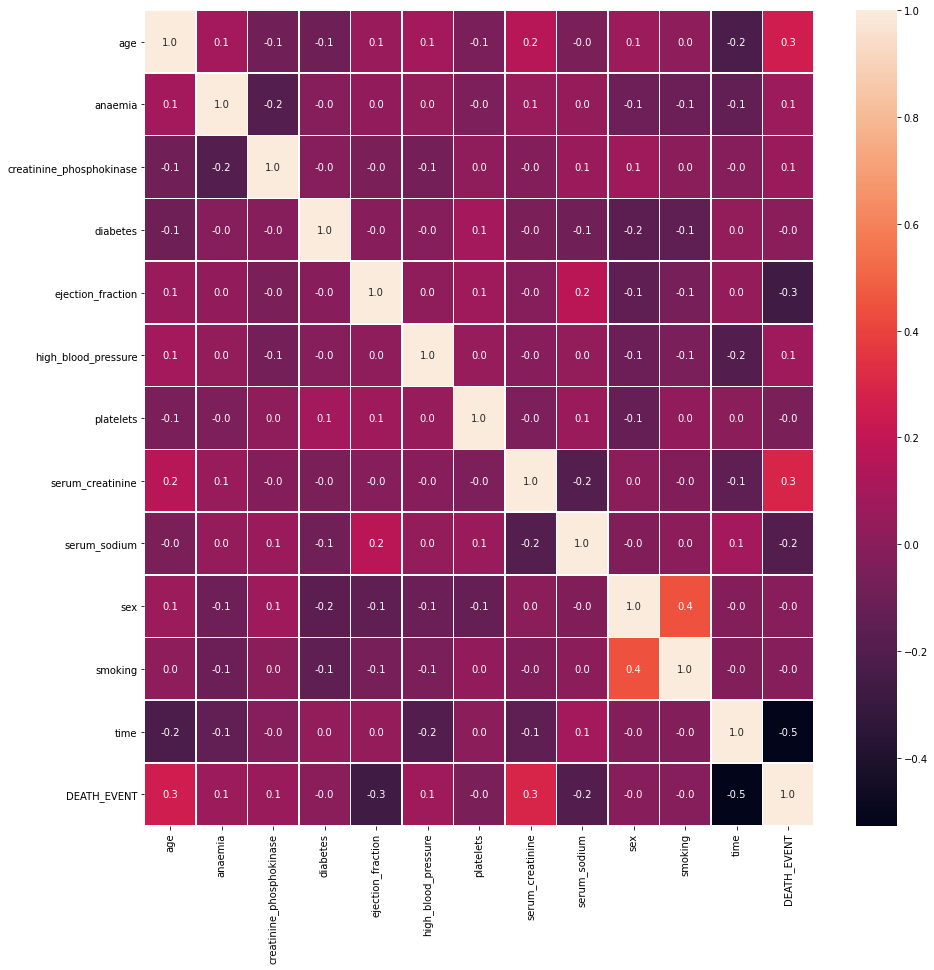


# Hypotesis and Application from articles

**Clinical predictors of heart failure in patients with first acute myocardial infarction** -
"Predictors of early heart failure include previous medical conditions and age. The second peak occurrence can be predicted by similar characteristics in addition to increased peak creatine phosphokinase level, decreased left ventricular ejection fraction, and increased heart rate" (Am Heart J 1999;138:1133-9.)

**Consideration** :

__Normal Values__:


  - Creatine phosphokinase: 2 - 210 mcg/L

  - Ejection fraction     : 50 %
  
  - Medical Follow-up : >=60 days

**For this dataset, does creatine phosphokinase (increase) and ejection fraction (decrease) are behaving regarding a health valeu as the article metioned?**


```python
import seaborn as sns; 
g1 = sns.pairplot(df,vars= ['creatinine_phosphokinase','ejection_fraction','time'], hue= 'DEATH_EVENT',markers=["o", "X" ],palette='dark')
```


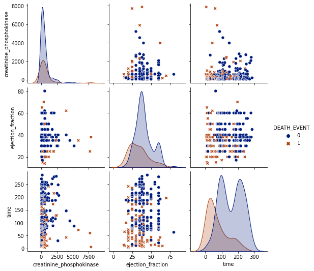


% Death event of people who creatinine phosphokinase increased over normal, ejection fraction under normal and medical follow up under the stander 60 days :


```python
H1 = df[['creatinine_phosphokinase', 'ejection_fraction','DEATH_EVENT','time']][(df['creatinine_phosphokinase'] > 210) & (df['ejection_fraction'] < 50) & (df['time'] < 60)]
H1['DEATH_EVENT'].mean()

```


    0.92


% Death event of people who creatinine phosphokinase increased over normal, ejection fraction under normal and medical follow up under the stander 60 days :


```python
H1 = df[['creatinine_phosphokinase', 'ejection_fraction','DEATH_EVENT','time']][(df['creatinine_phosphokinase'] > 210) & (df['ejection_fraction'] < 50) & (df['time'] >= 60)]
H1['DEATH_EVENT'].mean()
```


    0.21367521367521367


Going a little deeper...


```python
H1 = df[['creatinine_phosphokinase', 'ejection_fraction','DEATH_EVENT']][(df['creatinine_phosphokinase'] > 210) & (df['ejection_fraction'] < 50) & (df['DEATH_EVENT'] == 1)]
deathCr = H1['DEATH_EVENT'].count()

```


```python
H1 = df[['creatinine_phosphokinase', 'ejection_fraction','DEATH_EVENT']][(df['creatinine_phosphokinase'] > 210) & (df['ejection_fraction'] < 50)]

print(r'%s pacients of 299 had values had not normal value for each feature. Representing %s percent of pacients and %s percent of total death.  '%(H1.shape[0],round(((H1.shape[0]*100)/total),2), (deathCr*100)/total_death ))
```

    142 pacients of 299 had values had not normal value for each feature. Representing 47.49 percent of pacients and 50.0 percent of total death.  
    

**CONCLUSION**

 The value for creatinine phospkinase and ejection fraction are definitely significant for prediction of a heart failure. But a long-term medical follow-up must reduce drastically the chance of death. Which 92 % of the pacients passed away due heart failure who had creatinine phosphokinase's level above normal, ejection fraction under normal and medical follow-up less than 60 days. But, on another hand, only 21%  with same creatinine and ejection fraction behavior and medical follow-up equal, or more, than 60 days passed away due a heart failure pacients
 
 These unbalaced values are 47.5% of pacients and  50% of total of death in hole dataset. 


```python

```

**Role of Diabetes in Congestive Heart Failure** - "Men aged 45 to 74 years had more than twice the frequency of congestive heart failure as their nondiabetic cohorts, and diabetic women had a fivefold increased risk."

**For this dataset, What the frequency of diabetic-men aged 45 to 74 years to had heart failure more than non-diabetic? What the same analyze for women 30 to 62 years ?**


```python
man   =  df['sex'][(df['sex'] == 1)]
woman =  df['sex'][(df['sex'] == 0)]

m = (man.count()*100)/total
w = (woman.count()*100)/total


import matplotlib.pyplot as plt

labels = 'Men','Women' 
sizes  = [m,w]
explode = (0, 0)  # only "explode" the 2nd slice (i.e. 'Hogs')


fig1, ax1 = plt.subplots()
ax1.pie(sizes, explode=explode, labels=labels, autopct='%1.1f%%',
        shadow=True, startangle=90)
ax1.axis('equal')  # Equal aspect ratio ensures that pie is drawn as a circle.
plt.title("% Men & Women", bbox={'facecolor':'0.8', 'pad':5})
plt.show()

AM = df[['age','sex']][(df['sex'] == 1) & (df['age'] >= 45) & (df['age'] <= 74)]

labels = 'Hypotese age (45-74 years)','Out Hypotese age' 
sizes  = [(AM.count()[0]*100)/man.count(),((man.count()-AM.count()[0])*100)/man.count()]
explode = (0.1, 0)  # only "explode" the 2nd slice (i.e. 'Hogs')


fig1, ax1 = plt.subplots()
ax1.pie(sizes, explode=explode, labels=labels, autopct='%1.1f%%',
        shadow=True, startangle=90)
ax1.axis('equal')  # Equal aspect ratio ensures that pie is drawn as a circle.
plt.title("%Men in hypotese age ", bbox={'facecolor':'0.8', 'pad':5})
plt.show()


```


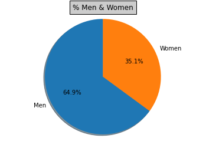


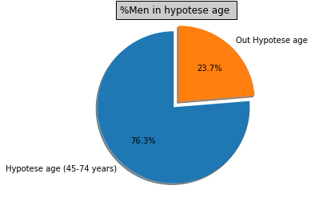


```python
g2 = sns.pairplot(df,vars= ['diabetes','age','sex','time'], hue= 'DEATH_EVENT',markers=["o", "X" ],palette='dark')
```


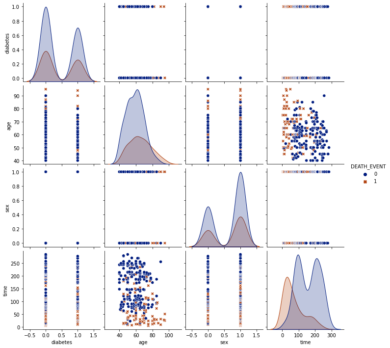


N Death events to diabetic-men aged 45 to 74 years


```python
H2 = df[['diabetes','age','sex','time','DEATH_EVENT']][(df['diabetes'] == 1) & (df['sex'] == 1) & (df['age'] >=45) & (df['age'] <= 74) & (df['DEATH_EVENT'] == 1)]
diab = H2['DEATH_EVENT'].count()
diab
```


    16


N Death events to non-diabetic-men aged 45 to 74 years


```python
H2 = df[['diabetes','age','sex','time','DEATH_EVENT']][(df['diabetes'] == 0) & (df['sex'] == 1) & (df['age'] >=45) & (df['age'] <= 74) & (df['DEATH_EVENT'] == 1)]
nodiab = H2['DEATH_EVENT'].count()
nodiab
```


    26


Frequency (% Death events to diabetic-men) / (% Death events to non-diabetic-men)


```python
diab/nodiab
```


    0.6153846153846154


```python
AW = df[['age','sex']][(df['sex'] == 0) & (df['age'] >= 30) & (df['age'] <= 62)]

labels = 'Hypotese age (30-62 years)','Out Hypotese age' 
sizes  = [(AW.count()[0]*100)/woman.count(),((woman.count()-AW.count()[0])*100)/woman.count()]
explode = (0, 0.1)  # only "explode" the 2nd slice (i.e. 'Hogs')

fig1, ax1 = plt.subplots()
ax1.pie(sizes, explode=explode, labels=labels, autopct='%1.1f%%',
        shadow=True, startangle=90)
ax1.axis('equal')  # Equal aspect ratio ensures that pie is drawn as a circle.
plt.title("%woman in age hypotese", bbox={'facecolor':'0.8', 'pad':5})
plt.show()


```


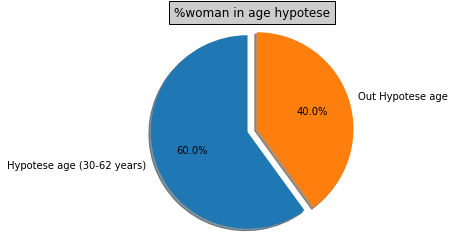


N Death events to diabetic-women aged 30 to 62 years


```python
H2 = df[['diabetes','age','sex','time','DEATH_EVENT']][(df['diabetes'] == 1) & (df['sex'] == 0) & (df['age'] >=30) & (df['age'] <= 62) & (df['DEATH_EVENT'] == 1)]
diab = H2['DEATH_EVENT'].count()
diab
```


    14


N Death events to non-diabetic-women aged 30 to 62 years


```python
H2 = df[['diabetes','age','sex','time','DEATH_EVENT']][(df['diabetes'] == 0) & (df['sex'] == 0) & (df['age'] >=30) & (df['age'] <= 62) & (df['DEATH_EVENT'] == 1)]
nodiab = H2['DEATH_EVENT'].count()
nodiab
```


    6


Frequency (% Death events to diabetic-women) / (% Death events to non-diabetic-women)


```python
diab/nodiab
```


    2.3333333333333335


**CONCLUSION**

 For this dataset, diabetic-men aged 45 to 74 years were less frequency (0.9 times) of death than non-diabetics
 Diabetic-women aged 30 to 62 year had more frequency (1.5 times) of death than non-diabetics.
 
 The hypotese doens't correspond to the value expected although just Diabetic-women had a incresing on Death events but under de 5 times frequency.  


```python

```


```python

```

 **Effect of Elevated Admission Serum Creatinine and Its Worsening on Outcome in Hospitalized Patients With Decompensated Heart Failure** - "Renal insufficiency (RI), as represented by elevated serum creatinine (>1.5 mg/dl) on admission, is common and found in almost half of patients hospitalized with decompensated heart failure" 


Consideration :

*Normal Values*

serum creatinine: < 1.5  mg/dL

Medical Follow-up : <=60 days


For this dataset, what the correlation of serum creatinine and death events? Is the follow-up time is relevant?


```python
g3 = sns.pairplot(df,vars= ['serum_creatinine','time'], hue= 'DEATH_EVENT',markers=["o", "X" ],palette='dark')
```


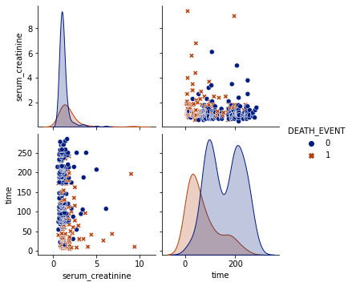


```python
H3 = df[['serum_creatinine','time','DEATH_EVENT']][(df['serum_creatinine'] > 1.5) & (df['time'] < 60) ]
deathCre = H3[(H3['DEATH_EVENT'] == 1)].count()
noDeathCre = H3[(H3['DEATH_EVENT'] == 0)].count()

total3 = H3.count()
#deathCre[0], noDeathCre[0],total3[0]

```

Total number of patients with serum creatinine over normal value:


```python
total3[0]
```


    23


Number of death event for total of patients with serum creatinine over normal value:


```python
deathCre[0] 
```


    21


% Death Event in total


```python
deathCre[0]*100/total3[0]
```


    91.30434782608695


%death events to follow-up over the 60 days:


```python
H3 = df[['serum_creatinine','time','DEATH_EVENT']][(df['serum_creatinine'] > 1.5) & (df['time'] >= 60) ]
deathCre = H3[(H3['DEATH_EVENT'] == 1)].count()
noDeathCre = H3[(H3['DEATH_EVENT'] == 0)].count()

total3 = H3.count()
#deathCre[0], noDeathCre[0],total3[0]
deathCre[0]*100/total3[0]
```


    50.0


Disregarding time, %Death events and total of pacients over >1.5 mg/dL


```python
H3 = df[['serum_creatinine','DEATH_EVENT']][(df['serum_creatinine'] > 1.5)]
deathCre = H3[(H3['DEATH_EVENT'] == 1)].count()
noDeathCre = H3[(H3['DEATH_EVENT'] == 0)].count()

total3 = H3.count()
#deathCre[0], noDeathCre[0],total3[0]
deathCre[0]*100/total3[0], total3[0]
```


    (64.17910447761194, 67)


**CONCLUSION**

 The value for serum creatinine (SC) are definitely significant for prediction of a heart failure. Considering the follow-up time under of 60 days, the death events for pacients with SC over normal value is equal to 91.3 % (21 pacients) in the total of 23 pacients. For pacients who follow-up were over 60 days, the death event goes to 50% (22 pacients) of total of 44 pacients. From total of 67 pacients, 64% passed away. 
 
 


```python

```


```python

```

**Anaemia is an independent predictor of poor outcome in patients with chronic heart failure** - "Mild anaemia is a significant and independent predictor of poor outcome in unselected patients with CHF."

What the relevance of anaemia to heart failure ?


```python
H4 = df[['anaemia','DEATH_EVENT','time']]

```

Number of pacients with anemia x without anemia


```python
H4[(H4['anaemia']==1)].count()[0], H4[(H4['anaemia']==0)].count()[0]

```


    (129, 170)


Number of pacients with anemia and passed away


```python
H4[(H4['anaemia']==1) & (H4['DEATH_EVENT']==1)].count()[0]
```


    46


%Death anaemie pacient / total anaemie pacient


```python
H4[(H4['anaemia']==1) & (H4['DEATH_EVENT']==1)].count()[0]*100/H4[(H4['anaemia']==1)].count()[0]
```


    35.65891472868217


```python
H4[(H4['anaemia']==1) & (H4['time']<= 60)].count()[0], H4[(H4['anaemia']==0) & (H4['time']<= 60)].count()[0]

```


    (33, 30)


```python
H4[(H4['anaemia']==1) & (H4['DEATH_EVENT']==1) & (H4['time']<= 60)].count()[0]
```


    28


```python

```


```python

```

**GENERAL OVERVIEW**

Death by gender


```python
G1 = df[['sex','DEATH_EVENT']]
```


```python
m   = G1[(G1['sex']==1) & (G1['DEATH_EVENT']==1)]
mdp = m['sex'].count()*100/G1[(G1['sex']==1)].count()[0]

w   = G1[(G1['sex']==0) & (G1['DEATH_EVENT']==1)]
wdp = w['sex'].count()*100/G1[(G1['sex']==0)].count()[0]
```


```python
labels = 'Death','No-Death' 
sizes  = [mdp,100-mdp]
explode = (0.1, 0)  # only "explode" the 2nd slice (i.e. 'Hogs')


fig1, ax1 = plt.subplots()
ax1.pie(sizes, explode=explode, labels=labels, autopct='%1.1f%%',
        shadow=True, startangle=90)
ax1.axis('equal')  # Equal aspect ratio ensures that pie is drawn as a circle.
plt.title("% Death in Men Sample", bbox={'facecolor':'0.8', 'pad':5})
plt.show()


labels = 'Death','No-Death' 
sizes  = [wdp,100-wdp]
explode = (0.1, 0)  # only "explode" the 2nd slice (i.e. 'Hogs')


fig1, ax1 = plt.subplots()
ax1.pie(sizes, explode=explode, labels=labels, autopct='%1.1f%%',
        shadow=True, startangle=90)
ax1.axis('equal')  # Equal aspect ratio ensures that pie is drawn as a circle.
plt.title("%Death in Women Sample ", bbox={'facecolor':'0.8', 'pad':5})
plt.show()
```


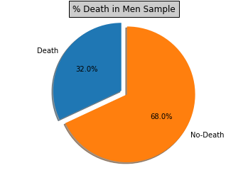


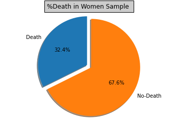


Death by Age


```python
#### 
```


```python

```

Death patient smokes x not 


```python
G3 = df[['smoking','DEATH_EVENT']]
```


```python
s   = G3[(G3['smoking']==1) & (G3['DEATH_EVENT']==1)]
ns  = G3[(G3['smoking']==0) & (G3['DEATH_EVENT']==1)]                              
      
Ts   = G3[(G3['smoking']==1) & (G3['DEATH_EVENT']==0)]
Tns  = G3[(G3['smoking']==0) & (G3['DEATH_EVENT']==0)] 

#s.count()[0], Ts.count()[0], ns.count()[0], Tns.count()[0]

```


```python
labels = 'Death','No-Death' 
sizes  = [ns.count()[0]*100/(ns.count()[0]+Tns.count()[0]), Tns.count()[0]*100/(ns.count()[0]+Tns.count()[0])]
explode = (0.1, 0)  # only "explode" the 2nd slice (i.e. 'Hogs')


fig1, ax1 = plt.subplots()
ax1.pie(sizes, explode=explode, labels=labels, autopct='%1.1f%%',
        shadow=True, startangle=90)
ax1.axis('equal')  # Equal aspect ratio ensures that pie is drawn as a circle.
plt.title("% Death in Smokers Sample", bbox={'facecolor':'0.8', 'pad':5})
plt.show()


labels = 'Death','No-Death' 
sizes  = [wdp,100-wdp]
explode = (0.1, 0)  # only "explode" the 2nd slice (i.e. 'Hogs')


fig1, ax1 = plt.subplots()
ax1.pie(sizes, explode=explode, labels=labels, autopct='%1.1f%%',
        shadow=True, startangle=90)
ax1.axis('equal')  # Equal aspect ratio ensures that pie is drawn as a circle.
plt.title("%Death in No-Smokers Sample ", bbox={'facecolor':'0.8', 'pad':5})
plt.show()
```


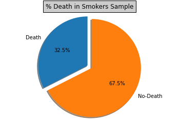


Death patient with high blood pressure x not


```python

```


```python

```


```python

```

Applying Machine Learning - Considering Time


```python
import numpy as np
```


```python
%matplotlib inline
import seaborn as sns
import xgboost as xgb
from sklearn.model_selection import train_test_split
from sklearn.metrics import r2_score
from sklearn.preprocessing import LabelEncoder
from sklearn.preprocessing import StandardScaler
from sklearn.pipeline import make_pipeline
from sklearn.linear_model import LinearRegression
from sklearn.model_selection import GridSearchCV
from sklearn.svm import LinearSVR , SVR
from sklearn.tree import  DecisionTreeRegressor
from sklearn.ensemble import RandomForestRegressor 
from xgboost import XGBRegressor
from sklearn.model_selection import train_test_split , KFold , cross_val_score,StratifiedKFold
from sklearn.metrics import mean_absolute_error , mean_squared_error
from sklearn.preprocessing import OneHotEncoder
from sklearn.feature_selection import SelectFromModel
from sklearn.linear_model import ElasticNet, Lasso, Ridge
from sklearn.feature_selection import SelectKBest
from sklearn.feature_selection import f_classif
from xgboost import XGBClassifier
from sklearn.datasets import load_iris
from sklearn.metrics import confusion_matrix
from sklearn.model_selection import train_test_split
from sklearn.model_selection import cross_val_score, KFold
from sklearn.ensemble import RandomForestClassifier
from sklearn.tree import DecisionTreeClassifier
from sklearn.ensemble import RandomForestClassifier
from sklearn.datasets import make_classification


import functools

import sys
import warnings

if not sys.warnoptions:
    warnings.simplefilter("ignore")
```


```python
X = df.drop('DEATH_EVENT',axis=1)
y = df['DEATH_EVENT']

X_train,X_test,y_train,y_test = train_test_split(X,y,test_size = 0.3,random_state = 42)
```


```python
def cross_valid (model,name,X = X_train , y= y_train):
  
  modelo = model()
  cv = 5  #quantidade de vezes q vai rodar 
  scoring = 'neg_mean_squared_error' # funcão mse dentro do cross_validation_score
  n_jobs = -1
  
  
  score = cross_val_score(modelo,X ,y , cv= cv , scoring= scoring, n_jobs= n_jobs)

  RMSE = np.sqrt(- score.mean())


 ##menor melhor
  print('RMSE',name,RMSE)
```


```python
cross_valid(RandomForestRegressor,'random_forest')
```

    RMSE random_forest 0.3310877086934085
    


```python
cross_valid(XGBRegressor,'xg_boost')
```

    RMSE xg_boost 0.3555536909123532
    


```python
cross_valid(Lasso,'lasso')
```

    RMSE lasso 0.3838246741795928
    


```python
cross_valid(Ridge,'ridge')
```

    RMSE ridge 0.3536173277735311
    


```python
cross_valid(SVR,'SVR')
```

    RMSE SVR 0.48558580486692
    


```python
cross_valid(LinearSVR,'Linear_SVR')
```

    RMSE Linear_SVR 0.6336108098091258
    


```python
cross_valid(XGBClassifier,'XGBClassifier')

```

    RMSE XGBClassifier 0.3849672294000657
    


```python
cross_valid(DecisionTreeClassifier,'Decision_tree')
```

    RMSE Decision_tree 0.42044166811032346
    


```python
cross_valid(RandomForestClassifier,'RandomForestClassifier')
```

    RMSE RandomForestClassifier 0.3656251706175088
    


```python

```


```python
X = df.drop('DEATH_EVENT',axis=1)
y = df['DEATH_EVENT']
```


```python
plt.figure(figsize=(13,6))
dt=RandomForestClassifier()
dt.fit(X,y)
feat_importances1 = pd.Series(dt.feature_importances_, index=X.columns)
feat_importances1.sort_values(ascending=True).plot(kind='barh')
plt.show()
```


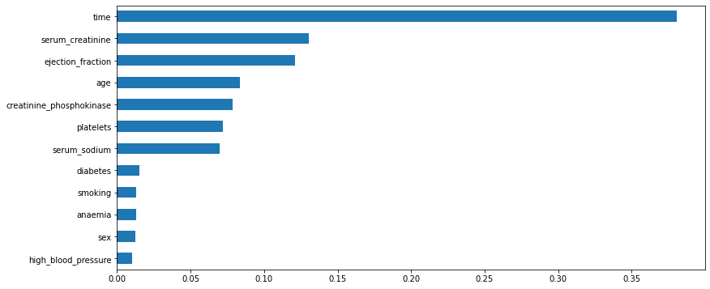


```python
feat_importances1.head(14)
```


    age                         0.083395
    anaemia                     0.013054
    creatinine_phosphokinase    0.078637
    diabetes                    0.015090
    ejection_fraction           0.120798
    high_blood_pressure         0.010296
    platelets                   0.071771
    serum_creatinine            0.130493
    serum_sodium                0.069820
    sex                         0.012747
    smoking                     0.013187
    time                        0.380713
    dtype: float64


```python

```


```python
param_grid = { 
            "n_estimators"      : [10,50,100,200,700],
            "max_features"      : ["auto", "sqrt", "log2"],
            "min_samples_split" : [2,4,8],
            "bootstrap": [True, False],
            }

```


```python
grid =GridSearchCV(RandomForestClassifier(), param_grid, cv=5, 
                   n_jobs=-1, verbose=1)
grid.fit(X_train, y_train)
```

    Fitting 5 folds for each of 90 candidates, totalling 450 fits
    

    [Parallel(n_jobs=-1)]: Using backend LokyBackend with 2 concurrent workers.
    [Parallel(n_jobs=-1)]: Done  60 tasks      | elapsed:   13.1s
    [Parallel(n_jobs=-1)]: Done 210 tasks      | elapsed:   51.3s
    [Parallel(n_jobs=-1)]: Done 450 out of 450 | elapsed:  1.7min finished
    


    GridSearchCV(cv=5, error_score=nan,
                 estimator=RandomForestClassifier(bootstrap=True, ccp_alpha=0.0,
                                                  class_weight=None,
                                                  criterion='gini', max_depth=None,
                                                  max_features='auto',
                                                  max_leaf_nodes=None,
                                                  max_samples=None,
                                                  min_impurity_decrease=0.0,
                                                  min_impurity_split=None,
                                                  min_samples_leaf=1,
                                                  min_samples_split=2,
                                                  min_weight_fraction_leaf=0.0,
                                                  n_estimators=100, n_jobs=None,
                                                  oob_score=False,
                                                  random_state=None, verbose=0,
                                                  warm_start=False),
                 iid='deprecated', n_jobs=-1,
                 param_grid={'bootstrap': [True, False],
                             'max_features': ['auto', 'sqrt', 'log2'],
                             'min_samples_split': [2, 4, 8],
                             'n_estimators': [10, 50, 100, 200, 700]},
                 pre_dispatch='2*n_jobs', refit=True, return_train_score=False,
                 scoring=None, verbose=1)


```python
RMSE_grid_param = np.sqrt(grid.best_score_)

RMSE_grid_param
```


    0.9384050025956979


```python
grid.best_params_
```


    {'bootstrap': True,
     'max_features': 'auto',
     'min_samples_split': 4,
     'n_estimators': 100}


```python
pred = grid.predict(X_test)
pred
```


    array([0, 0, 0, 1, 0, 0, 0, 0, 1, 0, 0, 0, 0, 0, 1, 1, 0, 0, 0, 0, 0, 0,
           1, 1, 1, 0, 0, 0, 0, 0, 1, 0, 1, 1, 1, 1, 0, 0, 0, 0, 0, 1, 0, 0,
           0, 0, 0, 0, 0, 0, 0, 0, 0, 0, 0, 0, 0, 1, 0, 1, 1, 1, 0, 0, 1, 1,
           0, 1, 0, 0, 1, 0, 0, 0, 0, 0, 0, 1, 0, 0, 0, 1, 0, 0, 0, 0, 0, 1,
           1, 0])


```python
score = r2_score(y_test,pred)
score
```


    0.08210096889342178


```python
MSE = mean_squared_error(y_test,pred)
MSE
```


    0.2222222222222222


```python
RMSE_pred = np.sqrt(MSE)
RMSE_pred
```


    0.4714045207910317


```python
pred2 = grid.predict(X_train)
MSE2 = mean_squared_error(y_train,pred2)
RMSE2_pred = np.sqrt(MSE2)
RMSE2_pred
```


    0.0


```python

```


```python
import pandas as pd
import seaborn as sn
import matplotlib.pyplot as plt

data = {'y_Actual':    y_test,
        'y_Predicted': pred 
        }

dft = pd.DataFrame(data, columns=['y_Actual','y_Predicted'])
confusion_matrix = pd.crosstab(dft['y_Actual'], dft['y_Predicted'], rownames=['Actual'], colnames=['Predicted'])

sn.heatmap(confusion_matrix, annot=True)
plt.show()
```


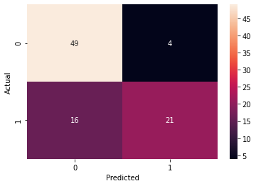


```python

```

_______________________________________________________________________

Applying Machine Learning -  Without Time


```python

```


```python
X = df.drop(['DEATH_EVENT', 'time'],axis=1)
y = df['DEATH_EVENT']
X_train,X_test,y_train,y_test = train_test_split(X,y,test_size = 0.3,random_state = 42)
```


```python
def cross_valid (model,name,X = X_train , y= y_train):
  
  modelo = model()
  cv = 5  #quantidade de vezes q vai rodar 
  scoring = 'neg_mean_squared_error' # funcão mse dentro do cross_validation_score
  n_jobs = -1
  
  
  score = cross_val_score(modelo,X ,y , cv= cv , scoring= scoring, n_jobs= n_jobs)

  RMSE = np.sqrt(- score.mean())


 ##menor melhor
  print('RMSE',name,RMSE)
```


```python

```


```python
cross_valid(RandomForestClassifier,'RandomForestClassifier')
```

    RMSE RandomForestClassifier 0.4637873676759594
    


```python
cross_valid(RandomForestRegressor,'random_forest')
```

    RMSE random_forest 0.3977204207745
    


```python
cross_valid(XGBRegressor,'xg_boost')
```

    RMSE xg_boost 0.40968810731337457
    


```python
cross_valid(Lasso,'lasso')
```

    RMSE lasso 0.4512461871781548
    


```python
cross_valid(Ridge,'ridge')
```

    RMSE ridge 0.41835811411245727
    


```python
cross_valid(SVR,'SVR')
```

    RMSE SVR 0.4855765692487356
    


```python
cross_valid(LinearSVR,'Linear_SVR')
```

    RMSE Linear_SVR 0.9000051885995444
    


```python
cross_valid(XGBClassifier,'XGBClassifier')

```

    RMSE XGBClassifier 0.4985460859015062
    


```python
cross_valid(DecisionTreeClassifier,'Decision_tree')
```

    RMSE Decision_tree 0.5312532024908597
    


```python
cross_valid(RandomForestClassifier,'RandomForestClassifier')
```

    RMSE RandomForestClassifier 0.45887809458619494
    


```python
plt.figure(figsize=(13,6))
dt=RandomForestRegressor()
dt.fit(X,y)
feat_importances1 = pd.Series(dt.feature_importances_, index=X.columns)
feat_importances1.sort_values(ascending=True).plot(kind='barh')
plt.show()
```


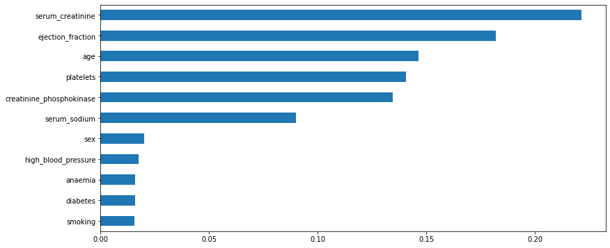


```python
X_train,X_test,y_train,y_test = train_test_split(X,y,test_size = 0.3,random_state = 42)
```


```python
param_grid = { 
            "n_estimators"      : [10,50,100,200],
            "max_features"      : ["auto", "sqrt", "log2"],
            "min_samples_split" : [2,4,8],
            "bootstrap": [True, False],
            }

```


```python
grid =GridSearchCV(RandomForestClassifier(), param_grid, cv=5, 
                   n_jobs=-1, verbose=1)
grid.fit(X_train, y_train)
```

    Fitting 5 folds for each of 72 candidates, totalling 360 fits
    

    [Parallel(n_jobs=-1)]: Using backend LokyBackend with 2 concurrent workers.
    [Parallel(n_jobs=-1)]: Done 164 tasks      | elapsed:   17.9s
    [Parallel(n_jobs=-1)]: Done 360 out of 360 | elapsed:   36.0s finished
    


    GridSearchCV(cv=5, error_score=nan,
                 estimator=RandomForestClassifier(bootstrap=True, ccp_alpha=0.0,
                                                  class_weight=None,
                                                  criterion='gini', max_depth=None,
                                                  max_features='auto',
                                                  max_leaf_nodes=None,
                                                  max_samples=None,
                                                  min_impurity_decrease=0.0,
                                                  min_impurity_split=None,
                                                  min_samples_leaf=1,
                                                  min_samples_split=2,
                                                  min_weight_fraction_leaf=0.0,
                                                  n_estimators=100, n_jobs=None,
                                                  oob_score=False,
                                                  random_state=None, verbose=0,
                                                  warm_start=False),
                 iid='deprecated', n_jobs=-1,
                 param_grid={'bootstrap': [True, False],
                             'max_features': ['auto', 'sqrt', 'log2'],
                             'min_samples_split': [2, 4, 8],
                             'n_estimators': [10, 50, 100, 200]},
                 pre_dispatch='2*n_jobs', refit=True, return_train_score=False,
                 scoring=None, verbose=1)


```python
RMSE_grid_param = np.sqrt(grid.best_score_)
RMSE_grid_param
```


    0.8939725901110832


```python
grid.best_params_
```


    {'bootstrap': True,
     'max_features': 'log2',
     'min_samples_split': 4,
     'n_estimators': 200}


```python
pred = grid.predict(X_test)
pred
```


    array([1, 0, 0, 1, 0, 0, 0, 0, 1, 1, 0, 0, 0, 0, 0, 0, 0, 0, 0, 0, 0, 0,
           1, 0, 0, 0, 0, 0, 0, 0, 1, 0, 0, 1, 0, 0, 0, 1, 0, 0, 0, 1, 0, 0,
           1, 0, 1, 0, 0, 0, 0, 0, 0, 0, 0, 0, 0, 1, 0, 1, 1, 1, 0, 0, 1, 0,
           0, 1, 0, 0, 1, 1, 0, 0, 1, 0, 0, 0, 0, 0, 0, 1, 0, 0, 0, 0, 0, 0,
           1, 0])


```python
score = r2_score(y_test,pred)
score
```


    -0.4227434982151961


```python
MSE = mean_squared_error(y_test,pred)
MSE
```


    0.34444444444444444


```python
RMSE_pred = np.sqrt(MSE)
RMSE_pred
```


    0.5868938953886337


```python
import pandas as pd
import seaborn as sn
import matplotlib.pyplot as plt

data = {'y_Actual':    y_test,
        'y_Predicted': pred 
        }

dft = pd.DataFrame(data, columns=['y_Actual','y_Predicted'])
confusion_matrix = pd.crosstab(dft['y_Actual'], dft['y_Predicted'], rownames=['Actual'], colnames=['Predicted'])

sn.heatmap(confusion_matrix, annot=True)
plt.show()
```


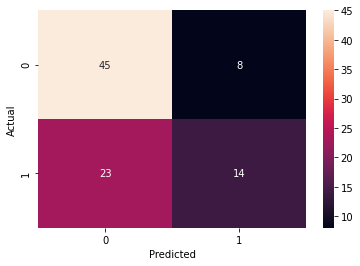


```python

```
